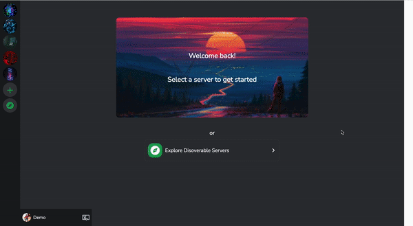

<a name="readme-top"></a>

<!-- PROJECT LOGO -->
<br />
<div align="center">
  <a href="https://github.com/claudiakosylak/group-discord-clone">
    
  </a>

<h3 align="center">Discordia</h3>

  <p align="center">
    Discordia is a Discord clone where users can create and join servers to chat with other members in live time.
    <br />
    <a href="https://github.com/claudiakosylak/group-discord-clone"><strong>Explore the docs »</strong></a>
    <br />
    <br />
    <a href="https://discordia.onrender.com">View Live Site</a>
    ·
    <a href="https://github.com/claudiakosylak/group-discord-clone/issues">Report Bug</a>
    ·
    <a href="https://github.com/claudiakosylak/group-discord-clone/issues">Request Feature</a>
  </p>
</div>

<!-- TABLE OF CONTENTS -->
<details>
  <summary>Table of Contents</summary>
  <ol>
    <li>
      <a href="#about-the-project">About The Project</a>
      <ul>
        <li><a href="#built-with">Built With</a></li>
      </ul>
    </li>
    <li>
      <a href="#getting-started">Getting Started</a>
    </li>
    <li><a href="#usage">Usage</a></li>
    <li><a href="#roadmap">Roadmap</a></li>
    <li><a href="#contact">Contact</a></li>
  </ol>
</details>


<!-- ABOUT THE PROJECT -->
## About The Project


This project was a group collaboration to clone Discord and its core functionality. The initial MVP was due within just over a week's time. Socket.io is implemented to allow chats to happen in live time.

Feature Highlights:
* Users can create a server, edit that server's details and delete the server
* Users can create, edit and delete channels for the servers they own
* Users can send messages within channels for servers they own or are a part of in real time, and can delete their own messages
* Users can view all of their existing servers in the left nav bar
* Users can discover new servers to join, join servers, and leave a server

<p align="right">(<a href="#readme-top">back to top</a>)</p>


### Built With

* 
* 
* 
* 
* 
* 
* 
* 
* 

<p align="right">(<a href="#readme-top">back to top</a>)</p>

<!-- GETTING STARTED -->
## Getting Started

To get a local copy up and running follow these simple example steps.

1. Clone this repository

2. Install dependencies

      ```bash
      pipenv install -r requirements.txt
      ```

3. Create a **.env** file with your environment variables based on this example:

   SECRET_KEY=your_secret_key
   DATABASE_URL=your_db_url
   SCHEMA=your_schema_name

   S3_BUCKET=your_bucket_name
   S3_KEY=your_key
   S3_SECRET=your_secret_key

4. Get into your pipenv, migrate your database, seed your database, and run your Flask app

   ```bash
   pipenv shell
   ```

   ```bash
   flask db upgrade
   ```

   ```bash
   flask seed all
   ```

   ```bash
   flask run
   ```

5. To set up the front end, cd into react-app in another terminal. Then install dependencies and start the app:

   ```bash
   npm install
   ```

   ```bash
   npm start
   ```

<p align="right">(<a href="#readme-top">back to top</a>)</p>


<!-- USAGE EXAMPLES -->
## Usage

### Sign Up

Users can sign in giving their details.


### Log In

Registered users can log in with their credentials. Users can also log in with one of two demo users to test functionality without creating an account.


### Send and Delete Messages

Users can send messages within channels for servers they are a part of. They can also delete messages that they have sent.


### Create a Server

Users can create a new server and choose a name for that server. A general channel is always automatically created for new servers.


### Edit a Server

Users can edit the name for servers they own.


### Delete a Server

Users can delete a server that they own. They are prompted to enter the name of the server to match so that they do not delete a server by mistake.


### Create a Channel

Users can create a channel for servers they own, choosing a name and a topic for that channel.


### Edit a Channel

Users can edit the details for channels that they own by clicking the cog next to the channel name.


### Delete a Channel

Users can delete channels for servers they own by clicking Delete Channel from within the Edit Channel modal.


### Discover Servers

Users can go to the discover servers page from either the left navigation bar or the home page upon login. Here they can see all of the servers they are not yet a part of.



### Join a Server

Users can join servers from the discover servers page. They are redirected to the server page once they join.


### Leave a Server

Users can leave servers that they are currently members of.


<p align="right">(<a href="#readme-top">back to top</a>)</p>


<!-- ROADMAP -->
## Roadmap

- [ ] AWS implementation to be able to upload pictures for server and user icons.
- [ ] Add reactions for messages.
- [ ] Direct messaging between two specific users.

See the [open issues](https://github.com/claudiakosylak/group-discord-clone/issues) for a full list of proposed features (and known issues).

<p align="right">(<a href="#readme-top">back to top</a>)</p>


<!-- CONTACT -->
## Contact

* Claudia Kosylak - claudiakosylak@gmail.com - https://github.com/claudiakosylak/
* Matt McBurnett - mattmcburnett@gmail.com - https://github.com/mattmcburnett
* James Lee - https://github.com/lee963654
* Hanna Rosenfeld - hannazrosenfeld@gmail.com - https://github.com/hannarosenfeld

Project Link: [https://github.com/claudiakosylak/group-discord-clone](https://github.com/claudiakosylak/group-discord-clone)

<p align="right">(<a href="#readme-top">back to top</a>)</p>
